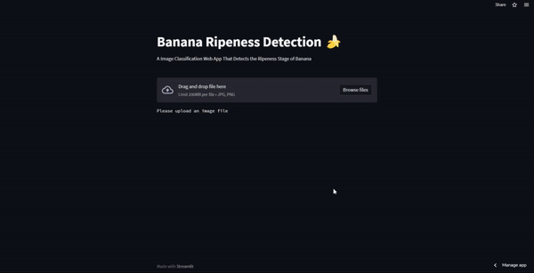
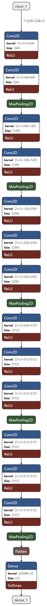

# Fruit Maturity Assessment System

### Features
- Predict the ripeness stage of banana.
- Classify banana into three different categories.
- Model can be used to predict other fruits as well.
- Simple and easy to understand architecture.
- Web app for testing images in realtime.

[Try it Now](https://share.streamlit.io/abhayparashar31/brd/main/app.py)

### Model Architecture
The architecture comprises multiple layers, beginning with an input layer to process 224x224 pixel images with three color channels. The model includes several convolutional layers with ReLU activations to extract features—starting with 64 filters and doubling in number after each max-pooling layer, ultimately reaching 512 filters. Following the convolutional base, the network utilized a flattening layer to convert the 2D feature maps into a 1D feature vector, and concluded with a fully connected dense layer employing softmax activation for categorical output. This design proved effective in capturing hierarchical patterns within the data, pivotal for precise classification.

## Contributing

Contributions are always welcome!!!!

**Developed By** [@TapusAggarwal](https://github.com/TapusAggarwal)
